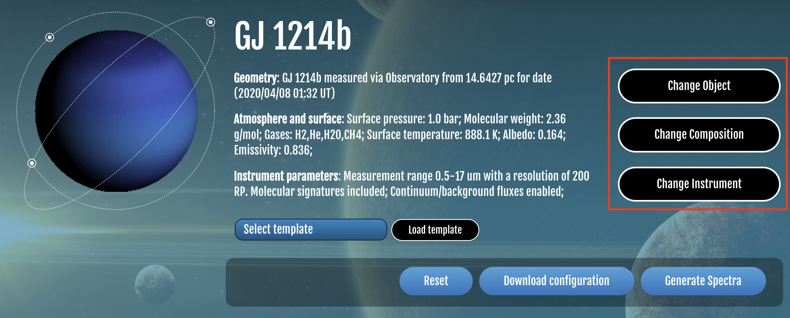
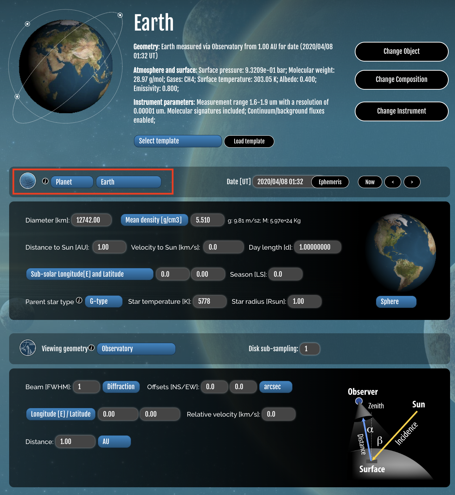
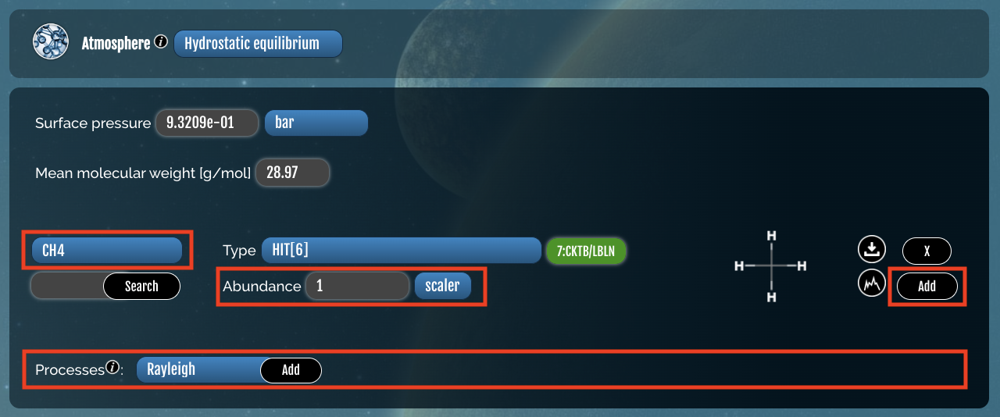
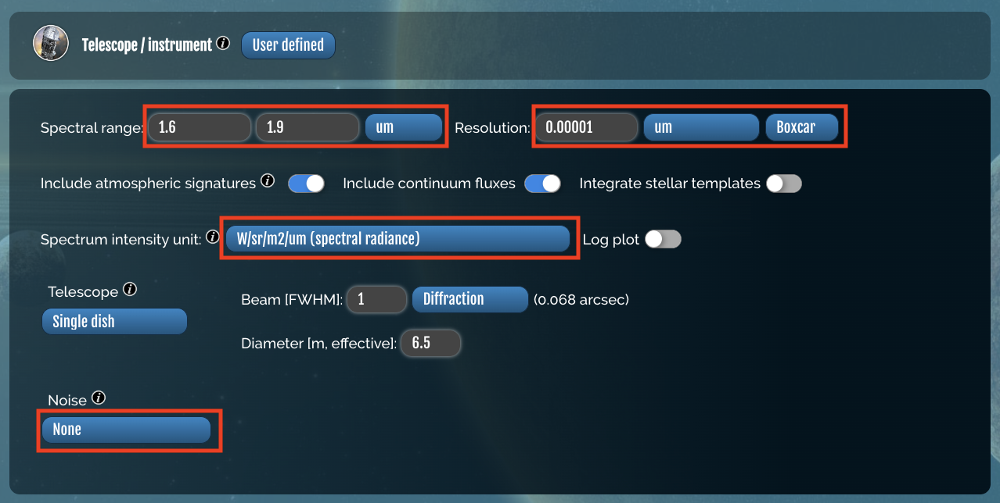
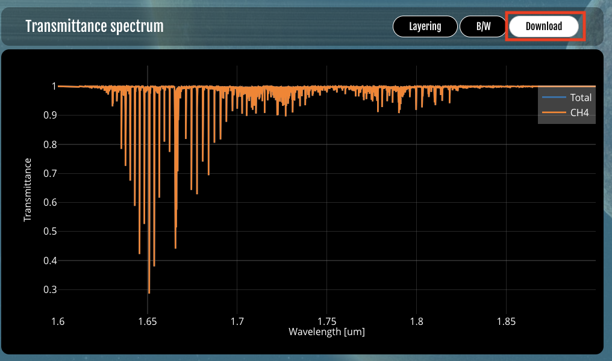

.. _psg_walkthrough:

Walkthrough NASA's Planetary Spectrum Generator
===============================================

The `Planetary Spectrum Generator <https://psg.gsfc.nasa.gov/>`_ allows you to generate Spectra with different parameters. 

We will want to fiddle with the settings using the options on the right. Make sure that you select **save settings** at the end of each step.

Change Object
-------------
* Set the planet to Earth.

Change Composition
------------------
* Select the gas species and specify their abundance
* Update the processes to Rayleigh

Change Instrument
------------------
* Set the spectral range
* Set the resolution
* Set the spectrum intensity unit to W/sr/m2/um (spectral radiance)
* Set Noise to none

Generate Spectra
-----------------
* Once all the settings are saved you are ready to generate spectra from the landing page

* Download the transmittence spectrum

:ref:`Return Home <home>`